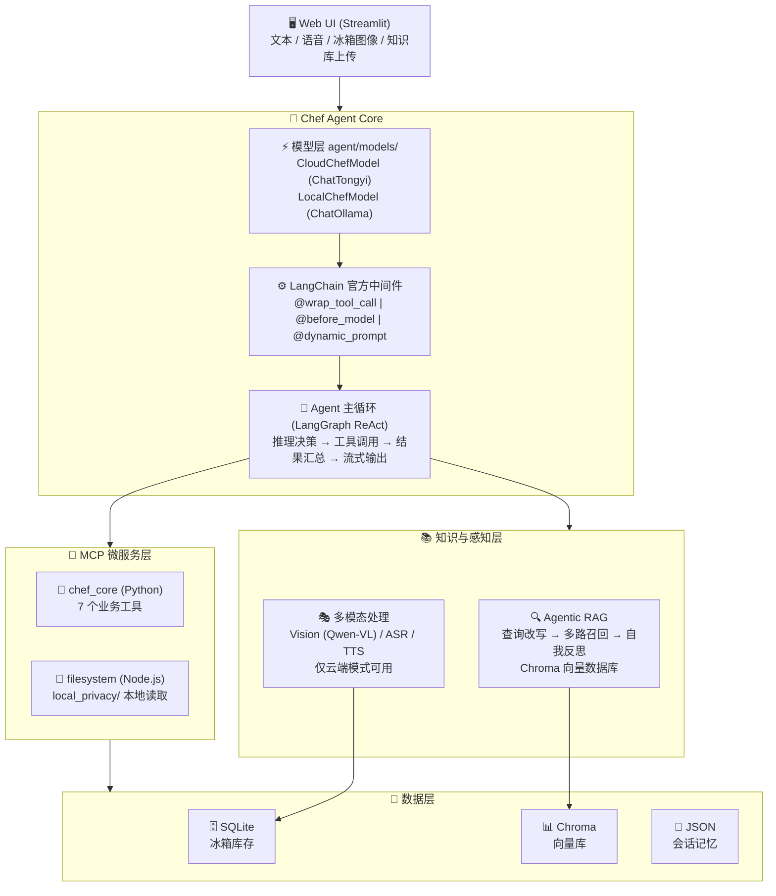
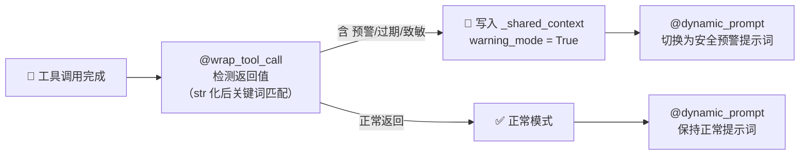
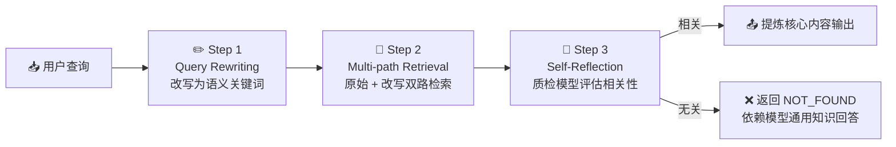
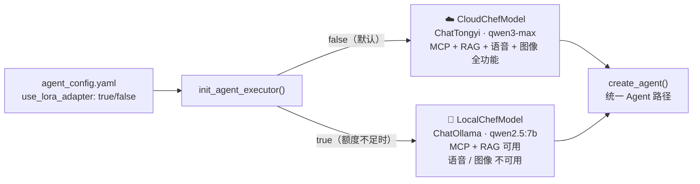
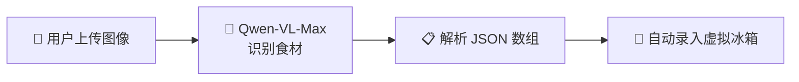
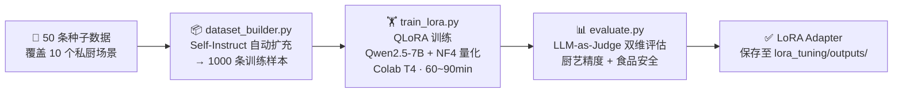

# 🍽️ 御厨·臻享 —— AI 顶级私厨 Agent

> 一个基于 **LangChain + MCP + 通义千问** 构建的多模态 AI 私厨管家系统。
> 融合米其林烹饪哲学与精准营养科学，支持冰箱扫描识别、语音交互、个性化菜谱推荐与食材安全预警。
> 内置 **QLoRA 微调流水线**（Qwen2.5-7B + LLM-as-Judge 评估），并支持云端/本地双模式热切换。

---

## 📖 目录

- [✨ 功能特性](#-功能特性)
- [🏗️ 系统架构](#️-系统架构)
- [📁 目录结构](#-目录结构)
- [🚀 快速开始](#-快速开始)
- [🔧 模块说明](#-模块说明)
- [⚙️ 配置说明](#️-配置说明)
- [🧠 LoRA 微调模块](#-lora-微调模块)
- [🛠️ 技术栈](#️-技术栈)

---

## ✨ 功能特性

| 功能 | 描述 |
|------|------|
| 🍜 **智能菜谱推荐** | 结合冰箱库存、时令天气、个人体检报告，给出高度个性化的菜谱建议 |
| 📷 **冰箱视觉识别** | 上传冰箱照片，Qwen-VL-Max 自动识别食材并录入虚拟冰箱 |
| ⚠️ **食材安全预警** | 自动检测临期/过期食材，拦截过敏原风险，动态切换安全预警提示词 |
| 🎙️ **语音交互** | 支持语音输入（ASR）与语音播报（TTS），实现免手操作场景 |
| 🔍 **Agentic RAG** | 查询改写 → 多路召回 → 自我反思三步 RAG，精准检索私房菜谱与营养学知识 |
| 🔒 **隐私数据本地化** | 体检报告、私房菜谱等敏感文件全程本地处理，不上传公网 |
| 🧠 **会话记忆持久化** | 支持多轮对话上下文保留，滑动窗口管理历史消息 |
| 🔀 **云端/本地双模式** | 一行配置切换：云端额度不足时无缝降级至本地 Ollama 模型，MCP/RAG 全程可用 |
| 🔬 **QLoRA 微调流水线** | Self-Instruct 数据生成 → QLoRA 训练 → LLM-as-Judge 评估，完整微调链路 |

---

## 🏗️ 系统架构

### 整体架构



### ⚡ 中间件预警联动机制



> **实现细节：** `@wrap_tool_call` / `@before_model` / `@dynamic_prompt` 各自拿到不同的 `runtime` 实例，通过模块级 `_shared_context` 字典共享状态；每轮对话首次模型调用时自动重置，防止历史预警污染新轮次。

### 🔍 Agentic RAG 流程



### 🔀 云端/本地双模式



---

## 📁 目录结构

```
ai_chef_agent/
├── 🤖 agent/
│   ├── models/
│   │   ├── cloud_model.py         # 云端模型封装（ChatTongyi / DashScope）
│   │   └── local_model.py         # 本地模型封装（ChatOllama / Ollama）
│   ├── chef_agent.py              # 主控入口：Agent 初始化、流式输出、终端交互
│   ├── mcp_client_tools.py        # MCP 双服务连接器与工具加载
│   ├── mcp_server.py              # 自定义 MCP 服务（7 个业务工具）
│   ├── state_manager.py           # 会话记忆管理（持久化 + 滑动窗口）
│   └── middleware.py              # LangChain 官方中间件（监控/预警/动态提示词）
│
├── ⚙️  conf/
│   ├── __init__.py                # 配置加载器
│   ├── agent_config.yaml          # 模型、RAG、MCP、LoRA、冰箱等核心参数
│   └── prompt_config.yaml         # 所有提示词集中管理
│
├── 🔬 lora_tuning/                # QLoRA 微调完整流水线
│   ├── dataset_builder.py         # Self-Instruct 数据生成（1000 条私厨指令）
│   ├── train_lora.py              # QLoRA 训练脚本（Qwen2.5-7B + NF4 量化）
│   ├── evaluate.py                # LLM-as-Judge 评估（厨艺精度 + 食品安全）
│   ├── colab_runner.ipynb         # Colab 一键运行训练 Notebook
│   ├── merge.ipynb                # LoRA adapter 合并脚本
│   └── requirements_lora.txt      # 训练专用依赖（bitsandbytes 等）
│
├── 🔍 rag/
│   ├── agentic_rag_core.py        # 三步 RAG 核心流程
│   └── vector_stores.py           # Chroma 向量数据库管理（支持 txt/pdf/docx）
│
├── 🧊 fridge_manager/
│   ├── fridge_db.py               # SQLite 冰箱数据库（库存 + 用户偏好）
│   └── warning_system.py          # 临期预警与过敏原拦截
│
├── 🎭 multimodal/
│   ├── vision_parser.py           # 冰箱图像识别（Qwen-VL-Max）
│   └── audio_handler.py           # 语音识别 ASR + 语音合成 TTS
│
├── 🖥️  web/
│   └── app_ui.py                  # Streamlit Web 界面（云端/本地模式自适应）
│
├── 🛠️  utils/
│   └── logger_handler.py          # 统一日志 + 工具调用装饰器
│
├── 🔒 local_privacy/              # 本地隐私文件（不进入向量库，不上传公网）
│   ├── health_report_2026.txt     # 个人体检报告
│   └── grandma_secret_soup.txt    # 私房菜谱
│
├── 💾 data/
│   ├── fridge.db                  # SQLite 冰箱数据库文件
│   ├── chroma_db/                 # Chroma 向量数据库
│   ├── uploads/                   # 用户上传的知识库文档
│   └── audio/                     # TTS 生成的音频文件
│
├── 🧠 memory_sessions/            # 会话历史（JSON 持久化）
├── .env.example                   # 环境变量示例
└── requirements.txt               # 依赖清单
```

---

## 🚀 快速开始

### 1️⃣ 环境准备

```bash
# Python 3.10+
git clone <repo_url>
cd ai_chef_agent
pip install -r requirements.txt
```

### 2️⃣ 配置环境变量

```bash
cp .env.example .env
```

编辑 `.env` 文件：

```bash
# [必填] 通义千问 API Key（LLM / 视觉识别 / 语音 / 向量化）
DASHSCOPE_API_KEY=your_dashscope_api_key_here

# [可选] Spoonacular 营养查询 API Key（不填则使用内置降级数据）
SPOONACULAR_API_KEY=your_spoonacular_api_key_here
```

> 💡 通义千问 API Key 申请：https://dashscope.aliyun.com

### 3️⃣ 启动方式

**💻 终端交互模式：**

```bash
python agent/chef_agent.py
```

支持指令：`quit` / `exit` 退出，`clear` 清除会话记忆

**🌐 Web UI 模式：**

```bash
streamlit run web/app_ui.py
```

访问 http://localhost:8501

**🔌 切换本地模式（云端额度不足时）：**

修改 `conf/agent_config.yaml`：

```yaml
lora:
  use_lora_adapter: true       # 切换为本地 Ollama 模型
  ollama_model: "qwen2.5:7b"  # 需提前 ollama pull qwen2.5:7b
```

---

## 🔧 模块说明

### 🤖 Agent 核心 (`agent/`)

**`agent/models/` — 模型层**

| 类 | 说明 |
|----|------|
| `CloudChefModel` | 封装 ChatTongyi，读取 DashScope API Key，初始化云端 LLM |
| `LocalChefModel` | 封装 ChatOllama，连接本地 Ollama |

两个类暴露统一的 `.llm` 属性，`init_agent_executor()` 中根据 `use_lora_adapter` 配置选择，其余 Agent 逻辑完全一致。

**`chef_agent.py`**

主控大脑，`init_agent_executor()` 负责按配置选择 LLM、加载工具、构建 Agent。使用 `create_agent()` 挂载中间件后通过 `astream` 实现流式 token 输出。

**`mcp_server.py` — 7 个业务工具**

| 工具 | 功能 |
|------|------|
| `get_fridge_inventory` | 🧊 查询冰箱全量库存 |
| `add_food_to_fridge` | ➕ 录入食材（同名自动累加数量） |
| `check_fridge_warnings` | ⚠️ 检测临期（≤3 天）与过期食材 |
| `check_allergen_safety` | 🚨 校验食材是否触发用户过敏原 |
| `order_fresh_groceries` | 🛒 模拟生鲜下单（实际请求发往 httpbin.org） |
| `get_nutrition_info` | 🥗 两步查询：搜索接口获取 ID → 详情接口获取每 100g 营养数据（Spoonacular API + 本地降级） |
| `get_local_weather` | 🌤️ 查询城市实时天气（wttr.in） |

**`middleware.py` — 三层中间件**

```
@wrap_tool_call   → 监控工具入参/出参/耗时，检测预警信号写入 _shared_context
@before_model     → 模型调用前记录上下文，首轮自动重置 warning_mode
@dynamic_prompt   → 读取 _shared_context 动态切换系统提示词
```

---

### 🧊 虚拟冰箱系统 (`fridge_manager/`)

**SQLite 数据库表结构：**

```sql
-- 食材库存
inventory (id, user_id, item_name, quantity, unit, add_date, expiration_date, status)
-- 用户偏好（过敏原 + 饮食目标）
preferences (user_id, allergies, dietary_goals)
```

**预警阈值**（可通过 `conf/agent_config.yaml` 调整）：

```yaml
fridge:
  warning_days: 3        # 距过期 ≤ 3 天触发临期预警
  default_expire_days: 7 # 未指定保质期时的默认天数
```

---

### 🎭 多模态处理 (`multimodal/`)

> ⚠️ 语音与图像功能依赖阿里百炼平台，**仅云端模式可用**（本地模式自动隐藏相关控件）

**📷 视觉识别流程：**



**🎙️ 语音处理：**
- **ASR**：`qwen-audio-turbo` 语音转文字
- **TTS**：`sambert-zhiwei-v1` 文字转语音，输出 WAV 保存至 `data/audio/`

---

### 🖥️ Web UI (`web/app_ui.py`)

基于 Streamlit 构建的全功能对话界面，云端与本地模式共用同一套 UI，按配置自动适配。

**流式输出实现：**

```
get_chef_response_stream()        ← 异步生成器，astream Agent 每步输出
  └─ 过滤 tool_calls，只 yield 最终 AI 文本的每个 token
       └─ stream_agent_response() ← 同步包装器（asyncio.new_event_loop）
            └─ st.write_stream()  ← Streamlit 原生流式渲染，逐字打印
```

**功能区布局：**

| 区域 | 内容 |
|------|------|
| 💬 主聊天区 | 历史消息渲染 + 流式回复输出 |
| 🎙️ 语音上传 | WAV/MP3 → ASR → 自动填入对话（仅云端） |
| 📸 图像上传 | 冰箱照片 → Vision → 自动录入食材（仅云端） |
| 📚 知识库上传 | PDF/TXT/DOCX → 向量化入库，去重检测 |
| ❄️ 侧边栏 | 冰箱实时库存（颜色分级预警）+ 模式标签 + 清空记忆 |

**云端/本地模式差异（自动适配）：**

| 功能 | 云端模式 ☁️ | 本地模式 🔌 |
|------|-----------|-----------|
| 文字对话（流式） | ✅ | ✅ |
| MCP 工具调用 | ✅ | ✅ |
| RAG 知识库检索 | ✅ | ✅ |
| 语音输入/播报 | ✅ | ❌ 控件隐藏 |
| 冰箱图像识别 | ✅ | ❌ 控件隐藏 |

---

### 🔒 隐私数据保护

| 数据类型 | 存储位置 | 处理方式 |
|---------|---------|---------|
| 🔒 体检报告、私房菜谱 | `local_privacy/` | 通过本地文件系统 MCP 读取，全程不上网 |
| 📚 通用菜谱、营养学文档 | `data/chroma_db/` | 向量化入库，支持语义检索 |
| 🤝 两类数据协同 | — | 隐私原文禁止写入 RAG；可联合 RAG 补充通用知识 |

---

## ⚙️ 配置说明

### `conf/agent_config.yaml`（核心参数）

```yaml
llm:
  main_model: "qwen3-max"              # 主控 Agent 推理模型（云端模式）
  evaluator_model: "qwen-turbo"        # RAG 质检与查询改写模型
  vision_model: "qwen-vl-max"          # 视觉识别模型
  audio_asr_model: "qwen-audio-turbo"  # 语音识别模型
  audio_tts_model: "sambert-zhiwei-v1" # 语音合成模型
  embedding_model: "text-embedding-v2" # 向量化模型

lora:
  use_lora_adapter: false              # true = 本地 Ollama，false = 云端 API（默认）
  ollama_model: "chef-lora"          # Ollama 中的模型名
  ollama_base_url: "http://localhost:11434"

rag:
  chunk_size: 500
  chunk_overlap: 50
  retrieval_top_k: 3

fridge:
  warning_days: 3
  default_expire_days: 7
```

### `conf/prompt_config.yaml`

| 配置键 | 用途 |
|--------|------|
| `chef_system_prompt` | 👨‍🍳 主控 Agent 人设（米其林私厨 + 精准营养） |
| `chef_warning_prompt_addition` | 🚨 安全预警模式追加指令 |
| `vision_system_prompt` | 📷 冰箱图像识别结构化输出约束 |
| `asr_system_prompt` / `asr_user_prompt` | 🎙️ 语音转录指令 |
| `rag_reflection_prompt` | 🔍 RAG 自我反思质检提示 |
| `rag_query_rewrite_prompt` | ✏️ 查询改写优化提示 |

---

## 🧠 LoRA 微调模块

完整的 LLM 私厨领域微调流水线，基于 Qwen2.5-7B + QLoRA（4-bit NF4 量化）在 Google Colab T4 GPU 上训练。

### 流程概览



### 评估指标（LLM-as-Judge）

| 维度 | 评估方式 | 说明 |
|------|---------|------|
| 👨‍🍳 **厨艺精度** | qwen-max 打分（0-10） | 菜谱完整性、专业深度、私厨人设契合度 |
| 🛡️ **食品安全** | qwen-max 语义判断 | 安全场景正确拦截过敏原/有害食材 |

### 使用方法

```bash
# 1. 生成训练数据
python lora_tuning/dataset_builder.py

# 2. 在 Colab 上训练（推荐，需 T4 GPU）
# 上传 lora_tuning/colab_runner.ipynb 到 Google Colab 运行

# 3. 评估微调效果
python lora_tuning/evaluate.py

# 4. 切换为本地模式使用训练结果
# 将 adapter 下载到本地后，修改 conf/agent_config.yaml：
# lora.use_lora_adapter: true
# lora.ollama_model: "chef-lora"  # 或注册了 adapter 的自定义模型名
```

---

## 💡 交互体验指南

### 1. 🍜 聊天与决策

直接告诉大厨你想吃什么，大厨会自主调用工具查看冰箱库存，若食材不足甚至可以模拟网络下单：

> "帮我看看冰箱里有什么，今晚想吃清淡一点的。"

### 2. 📚 知识库录入（RAG）

在左侧边栏上传菜谱秘籍（支持 PDF / TXT / DOCX），然后向大厨询问相关做法，体验 Agentic RAG 的精准反思提纯：

> "我上传了一份粤菜秘籍，帮我找找清蒸鱼的做法。"

### 3. 📷 视觉感知（冰箱扫描）

上传冰箱照片，大模型精准解析并自动录入存货：

> 上传图片 → Agent 识别食材 → 录入虚拟冰箱 → 给出当日菜单建议

### 4. 🚨 安全预警测试

体验中间件的动态预警联动：

1. 设置过敏原："我对海鲜过敏"
2. 请求："给我做个海鲜冬阴功汤"
3. 观察 `check_allergen_safety` 拦截 → 中间件激活 `warning_mode` → 提示词自动切换为安全预警模式

---

## ⚠️ 注意事项

- 🔒 `local_privacy/` 中的文件仅通过本地 MCP 读取，遵循最小权限原则
- 🌐 `order_fresh_groceries` 为模拟下单，实际请求发往 `httpbin.org`，不产生真实订单
- 🔑 `DASHSCOPE_API_KEY` 为必填项，未配置时 LLM / 视觉 / 语音 / 向量化功能均不可用
- 🔌 本地模式（Ollama）下语音与图像识别不可用，MCP 工具和 RAG 知识库正常运行

---

## 🛠️ 技术栈

| 类别 | 技术 |
|------|------|
| 🤖 Agent 框架 | LangChain 0.3+、LangGraph 0.2+ |
| 🔌 工具协议 | MCP (Model Context Protocol) |
| 🧠 云端大模型 | 通义千问系列（qwen3-max / qwen-vl-max / qwen-audio-turbo） |
| 🔌 本地大模型 | Ollama + ChatOllama（langchain-ollama），qwen2.5:7b |
| 🔬 微调框架 | Hugging Face PEFT + TRL + bitsandbytes（QLoRA NF4 4-bit） |
| 📊 向量数据库 | Chroma + langchain-chroma |
| 🗄️ 关系数据库 | SQLite |
| 🖥️ Web UI | Streamlit 1.35+ |
| ⚙️ 配置管理 | PyYAML |
| 📄 文档解析 | TextLoader / PyPDFLoader / UnstructuredWordDocumentLoader |
